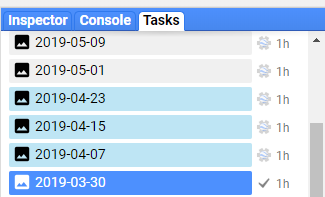

# gee_monkey

Batch export Google Earth Engine (GEE) tasks with `Tampermonkey`.

+ Tired of click GEE tasks run button in browser? 
+ Tired of translate `JavaScript` into `python`, because of `JavaScript` inconvenient batch exporting? 
+ Tired of paste JavaScript into console?  

__Tampermonkey can solve those problems!__

## Functions
- **rALL** : batch run all tasks
- **cALL** : cancel all tasks
- **cSUB** : only cancel `submitted-to-backend` tasks, and leave `running-on-backend` tasks to be continue

**Tasks submitted to GEE have two kinds:**   
1. `task submitted-to-backend`: just submitted and waiting in the queue  
2. `task running-on-backend`: submitted and running now (in skyblue backgroud)

## Updates  

* 2018-07-20   
  1. `running-on-backend` task's background is set to skyblue to distinguish `submitted-to-backend` task.

## Installation

You need `chrome` and [Tampermonkey](https://chrome.google.com/webstore/detail/tampermonkey/dhdgffkkebhmkfjojejmpbldmpobfkfo) (`firefox` is also OK).  
You also can submit tasks by your phone with `firefox` and `Tampermonkey`.

+ 1 Install [Tampermonkey](https://chrome.google.com/webstore/detail/tampermonkey/dhdgffkkebhmkfjojejmpbldmpobfkfo) extension in `chrome` or `firefox`.
+ 2 Dashboard → New script → paste the script in [gee_monkey](https://github.com/kongdd/GEE_Tools/blob/master/gee_monkey.js) → F5 refresh GEE website.

## Donation 

* Donate first then email to me ask for gee_monkey (kongdd.sysu at gmail.com)

